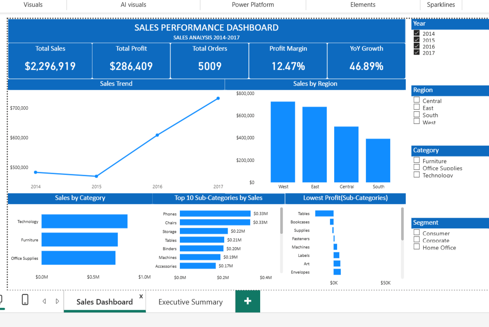
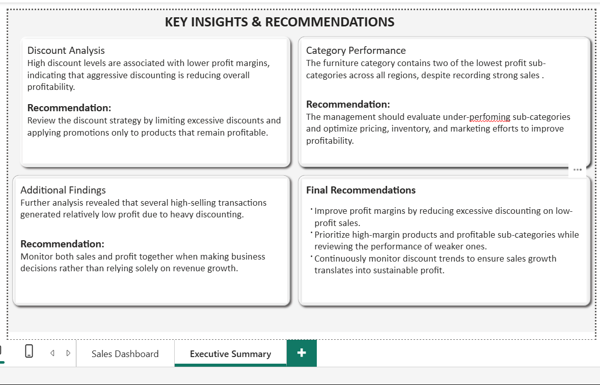

  # Sales Performance Dashboard (Power BI)

## Overview
This project showcases an interactive Sales Performance Dashboard built in Microsoft Power BI using a retail sales dataset. The dashboard provides insights into sales, profit, discounts, customer behaviour, and product performance to support data-driven business decisions.

## Objectives
- Analyse overall sales and profitability.
- Monitor key business performance indicators (KPIs).
- Identify top-performing and underperforming categories.
- Evaluate the impact of discounts on profit.
- Present findings through an interactive dashboard and executive summary.

## Tools Used
- Microsoft Power BI
- Power Query
- Microsoft Excel

## Dashboard Features
- Executive Summary
- Sales Performance Overview
- KPI Cards
- Regional Sales Analysis
- Category & Sub-category Performance
- Discount & Profit Analysis
- Interactive Filters and Slicers

- 

## Key Insights
- Higher discounts were associated with lower profit margins.
- Some Furniture sub-categories recorded low profitability despite strong sales.
- Several high-sales transactions generated relatively low profit due to heavy discounting.

## Recommendations
- Apply discounts strategically to protect profitability.
- Improve pricing and inventory strategies for underperforming sub-categories.
- Monitor both sales and profit when evaluating business performance.

- 

## Repository Contents
- Sales Dashboard.pbix – Power BI dashboard
- Raw Data – Original dataset
- Cleaned Data – Prepared dataset
- README.md – Project documentation
- Dashboard Screenshot – Preview of the dashboard

## Skills Demonstrated
- Data Cleaning
- Data Modelling
- DAX
- Data Visualization
- Dashboard Design
- Business Intelligence
- Data Storytelling

*Author:* Amidat Abass 
*Project Type:* Data Analytics Portfolio Project
